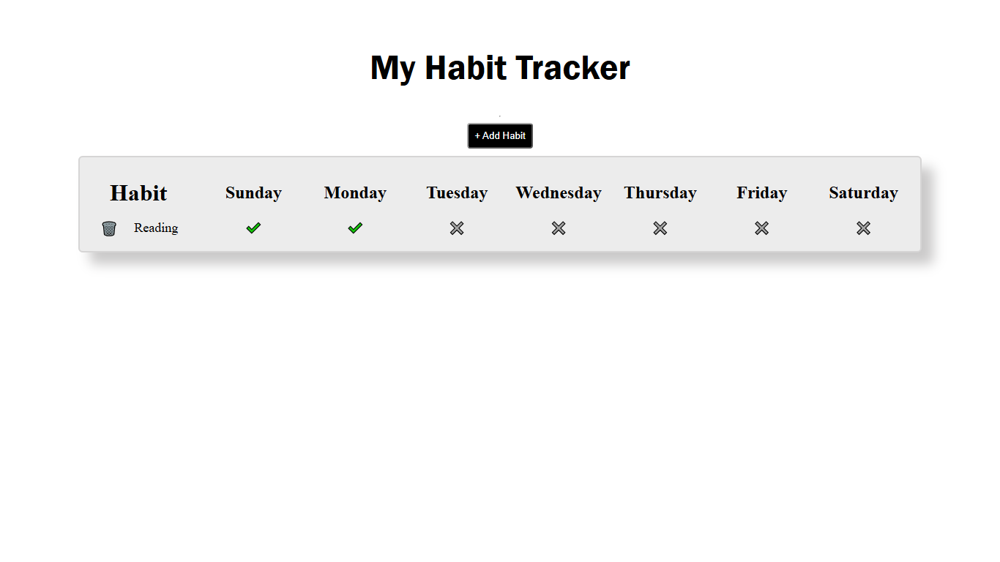

Habit Tracker

A simple and interactive habit tracker built with HTML, CSS, and vanilla JavaScript. Add habits, track them throughout the week, and remove them when needed.

Preview

Features
Add new habits
Track habits from Monday to Sunday
Mark daily habits as complete or incomplete
Delete habits
Prevents empty habits from being added
Press Enter to quickly add a habit
Simple and lightweight interface
No external libraries or dependencies
Technologies
HTML
CSS
JavaScript
How It Works
Click the Add Habit button.
Enter the name of your habit.
Add the habit to your tracker.
Click a day's ❌ to mark the habit as completed ✔️.
Click the 🗑️ button to delete the habit.
Project Structure
habit-tracker/
├── index.html
├── style.css
├── script.js
├── habit-tracker.png
└── README.md

Getting Started

Clone the repository:

git clone https://github.com/your-username/habit-tracker.git

Open index.html in your browser to start tracking your habits.

## Preview

License

This project is open source and available under the MIT License.
